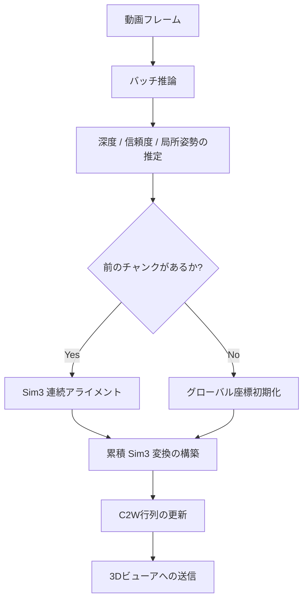

# カメラ姿勢推定アルゴリズムの概要

本プロジェクト（Depth-Anything-3）におけるカメラの姿勢推定（軌跡生成）アルゴリズムの詳細をまとめます。

## アルゴリズムの全体像

このシステムは、単眼動画からグローバルなカメラ姿勢（Camera-to-World: C2W行列）を動的に推定します。連続するフレームを「チャンク（塊）」として処理し、**Sim3（相似変換）**を用いて各チャンクをグローバル座標系に統合します。

## 主要なステップ

### 1. バッチ推論 (Batch Inference)
一定数のフレーム（例: 8枚）をまとめて `DepthAnything3` モデルに投入します。
- **出力**: 深度マップ、信頼度（Confidence）マップ、およびチャンク内の相対的な姿勢（Local Extrinsics）。

### 2. 連続アライメント (Sequential Alignment)
チャンク同士を繋ぎ合わせるために、オーバーラップ（重なり）部分を利用します。
1. **オーバーラップの抽出**: 前のチャンクの後半 $N$ フレームと、現チャンクの最初 $N$ フレームを比較。
2. **点群への投影**: 深度と内部パラメータを用いて、重なり部分のピクセルを 3D 点群に変換。
3. **Sim3 推定**: 2 つの点群間で、**スケール ($s$)、回転 ($R$)、平行移動 ($t$)** の 7 自由度変換を推定。
    - **信頼度重み付け**: 信頼度マップを用いて、空や動体などの不安定な領域を除外します。

### 3. 累積変換 (Cumulative Transformation)
推定された相対的な Sim3 変換を、これまでの全プロセスにおける累積変換行列に統合します。これにより、全てのカメラ位置が単一のグローバルな世界座標系にマッピングされます。

### 4. グローバル姿勢の適用
累積された Sim3 行列をチャンク内の局所姿勢に適用し、最終的なカメラ軌跡を算出します。

## 技術的特徴

| 要素 | 説明 |
| :--- | :--- |
| **Sim3 アライメント** | 単眼深度推定に特有の「スケールの不確定性」を解決するために必須の要素です。 |
| **信頼度ベースのフィルタリング** | 推定精度の低いピクセルをアライメント計算から除外することで、ドリフト（ズレ）を最小限に抑えます。 |
| **リアルタイム可視化** | `DepthProcessor` (QThread) がバックグラウンドで計算を行い、結果を GUI へ逐次送信します。 |

---
> [!NOTE]
> 本アルゴリズムは `da3_streaming.py` および `custom_gui/depth_processor.py` に実装されています。
